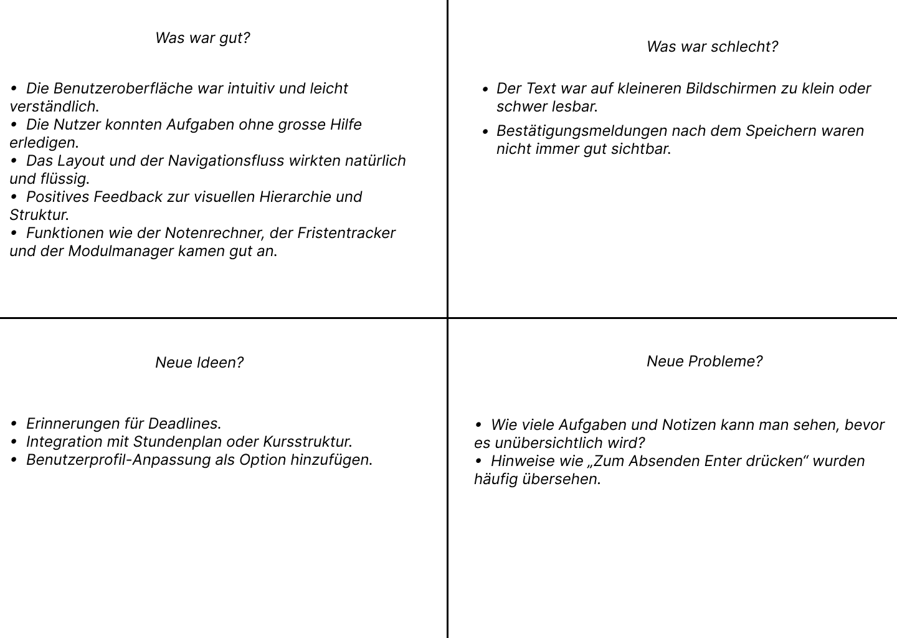

### Hypothese für MyStudentPal

**Was wissen wir?**

- Studierende haben oft Schwierigkeiten, ihre akademischen und persönlichen Verpflichtungen zu organisieren.

- Digitale Tools, die das akademische Aufgabenmanagement und die Notenverfolgung zentralisieren, können Stress reduzieren und die Produktivität von Studierenden steigern.

- Eine saubere, minimalistische Benutzeroberfläche (UI) wird von Studierenden für den täglichen Gebrauch bevorzugt.

**Was wissen wir nicht?**

- Ob Studierende die zentralen Funktionen der App (z. B. Aufgabenerstellung, Notenübersicht) ohne Einführung oder Anleitung erkennen und verstehen können.

- Ob das UI-Design mit den mentalen Modellen der Studierenden in Bezug auf akademische Arbeitsabläufe übereinstimmt.

- Ob die App in intensiven Lernphasen ein Gefühl von Überblick, Kontrolle oder emotionaler Entlastung vermittelt.

**Was wollen wir testen?**

- Können Studierende zentrale Aktionen (z. B. Registrierung, Aufgabenerstellung, Notenberechnung) erfolgreich und ohne Verwirrung oder externe Hilfe durchführen?

- Finden Studierende die Benutzeroberfläche optisch ansprechend und beruhigend?

- Motiviert die App zu einer regelmässigen Nutzung und Reflexion (z. B. durch Zitate oder visuelles Feedback)?

- Sind die Icons, Begriffe und Bedienelemente intuitiv und selbsterklärend?

**Wie bewerten wir den Test?**

- Beobachtung der Nutzer/innen beim Ausführen vordefinierter Aufgaben, wobei Pausen, Fragen oder Zögern notiert werden.

- Zählen von Navigationsfehlern (z. B. Fehlklicks, Zurückgehen).

- Durchführung kurzer Interviews oder Umfragen, um wahrgenommene Klarheit, Nützlichkeit und emotionale Eindrücke zu erfassen.

- Nachverfolgung, mit welchen Elementen die Nutzer/innen am häufigsten interagieren und welche übersehen werden.

**Was definiert Erfolg?**

- Die Nutzer/innen führen alle Kernaufgaben ohne externe Hilfe durch.

- Die Nutzer/innen äussern, dass die App intuitiv und hilfreich ist.

- Die Nutzer/innen beschreiben den Zweck der App korrekt und sagen, dass sie sie regelmässig verwenden würden.

- Es treten nur minimale Nutzbarkeitsprobleme auf (z. B. Verwirrung, unklare Symbole, fehlendes Feedback).

### Protokoll Nutzertest

| **Seite/Bereich**                 | **Feedback**                                                                 |
|-----------------------------------|------------------------------------------------------------------------------|
| **Login-Seite**                   | Verständlich. Der Lade-Spinner während der Datenabfrage zeigt den Fortschritt effektiv an. |
| **Registrierung**                 | Verständlich, erforderliche Felder wurden ohne zusätzliche Anleitung erkannt.                  |
| **Dashboard**                     | Verständlich. Die Nutzer mochten das Diagramm, die Statistiken und das motivierende Zitat. Insgesamt sind die Elemente gut platziert und tragen zu einem positiven ersten Eindruck bei. |
| **Navigationsleiste**             | Verständlich, klare Struktur; der Logout-Button ist auf jeder Seite sichtbar. |
| **Aufgaben-Deadline-Tracker**     | Das Layout ist intuitiv und gut strukturiert, mit klar unterscheidbaren Farben zur Kennzeichnung der unterschiedlichen Prioritätsstufen. |
| **Neue Aufgabenmaske**            | Verständlich und benutzerfreundlich. Die Platzierung der Elemente ist logisch und optisch ansprechend. Die Nutzer schätzten die Verwendung von Dropdown-Menüs und optionalen Feldern. Die farbliche Kennzeichnung der Prioritäten war besonders hilfreich, um die Wichtigkeit der Aufgaben zu unterscheiden. Nach dem Speichern sind die Änderungen im Kalender sichtbar. |
| **Globale Einstellungen**         | Übersichtliche und intuitive Benutzeroberfläche. Die Nutzer schätzten das strukturierte Layout und die einfache Konfiguration der Bewertungskriterien. Die Dropdown-Menüs und Umschaltoptionen waren selbsterklärend. Die Darstellung der aktuellen Einstellungen in Tabellenform am unteren Rand trug zur Transparenz und Klarheit bei. |
| **Modulmanager**                  | Die Benutzeroberfläche ist übersichtlich und gut strukturiert. Die Nutzer konnten die bestehenden Module auf einen Blick erfassen, wobei das Tabellenlayout zur Klarheit beiträgt. Die Schaltfläche „Neues Modul hinzufügen“ war leicht zu erkennen. Ein kleiner Verbesserungsvorschlag: Das Hinzufügen von Symbolen oder Bearbeiten-/Löschen-Optionen neben jedem Modul könnte die Interaktivität erhöhen. |
| **Modul hinzufügen**              | Verständlich, Das Formular ist leicht verständlich und visuell konsistent mit dem restlichen Design der App. Die Eingabefelder sind klar beschriftet, und die Verwendung von Stepper-Steuerelementen für die ECTS-Punkte wurde als intuitiv empfunden. Einige Nutzer bemerkten jedoch den Hinweis „Zum Absenden Enter drücken“ nicht sofort. Eine deutlichere Handlungsaufforderung oder ein sichtbarer Beschriftungstext des Absende-Buttons könnte die Benutzerfreundlichkeit verbessern. |
| **Notenrechner**                  | Die Oberfläche ist übersichtlich und benutzerfreundlich. Nutzer konnten Bewertungen leicht hinzufügen und die tabellarische Übersicht ermöglicht eine schnelle Erfassung von Gewichtung, Note und Zeitstempel. Besonders positiv hervorgehoben wurde die Sektion „Endnoten pro Modul“, die Transparenz über den Leistungsstand bietet. Kleinere Verbesserungsmöglichkeiten wären eine klarere Kennzeichnung der Bewertungstypen (z. B. „mid“ oder „final“) und eine sichtbare Gesamtdurchschnittsnote.|
| **Bewertung hinzufügen**          | Das Formular ist übersichtlich und im Einklang mit dem Design der App. Alle Eingabefelder sind klar beschriftet, und das Dropdown-Menü zur Modulauswahl verbessert die Benutzerfreundlichkeit. Die Stepper-Steuerung für Gewichtung und Note wurde als intuitiv wahrgenommen. Das Feld für „Bewertungsname“ könnte jedoch von einem klareren Beispiel oder einem präziseren Platzhalter profitieren. Ausserdem würden sich Nutzer über eine Rückmeldung freuen, wenn Werte fehlen oder ungültig sind.|
| **Design & Farbthema**            | Die Nutzer schätzten die Möglichkeit, zwischen hellem und dunklem Design zu wechseln. Der Dark Mode wurde als modern und augenschonend bei längerer Nutzung empfunden – besonders in dunkler Umgebung. Der Wechsel zwischen den Designs verlief reibungslos, ohne negative Auswirkungen auf Lesbarkeit oder Layout. Farbwahl und Kontrastverhältnis waren in beiden Modi gut abgestimmt und unterstützten die visuelle Klarheit.|

###  Auswertung des Nutzertests

