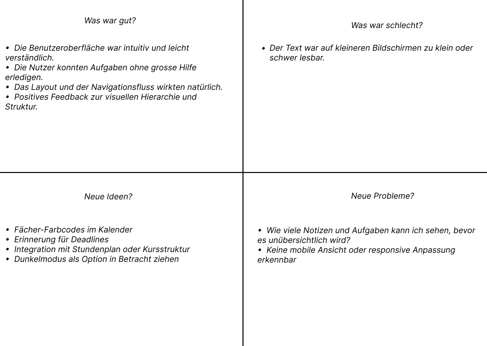

### Hypothese für MyStudentPal

**Was wissen wir?**

- Studierende haben oft Schwierigkeiten, ihre akademischen und persönlichen Verpflichtungen zu organisieren.

- Digitale Tools, die das akademische Aufgabenmanagement und die Notenverfolgung zentralisieren, können Stress reduzieren und die Produktivität von Studierenden steigern.

- Eine saubere, minimalistische Benutzeroberfläche (UI) wird von Studierenden für den täglichen Gebrauch bevorzugt.

**Was wissen wir nicht?**

- Ob Studierende die grundlegenden Funktionen von MyStudentPal unmittelbar nach dem Öffnen der App verstehen.

- Ob die Benutzeroberfläche ihren Arbeitsablauf unterstützt oder eher hinderlich ist.

- Ob die App ein Gefühl von Kontrolle, Klarheit oder emotionaler Erleichterung vermittelt.

**Was wollen wir testen?**

- Können Studierende zentrale Aktionen wie Registrierung, Anmeldung, Hinzufügen von Aufgaben und Berechnung von Noten ohne Verwirrung durchführen?

- Finden Studierende die App optisch ansprechend und beruhigend?

- Ermutigt die App zur regelmässigen Nutzung und zum emotionalen Ausdruck?

- Sind die Symbole und Beschriftungen klar genug, um Nutzer/innen intuitiv zu leiten?

**Wie bewerten wir den Test?**

- Beobachtung der Nutzer/innen beim Ausführen von Aufgaben ohne Unterstützung.

- Zählen von Pausen, Zögern oder Fehlklicks.

- Nutzer/innen sollen ihr Verständnis der App und ihre allgemeine Erfahrung beschreiben.

- Direktes Feedback zu Klarheit, Nützlichkeit und emotionaler Wirkung einholen.

**Was definiert Erfolg?**

- Die Nutzer/innen führen alle Kernaufgaben ohne externe Hilfe durch.

- Die Nutzer/innen äussern, dass die App intuitiv und hilfreich ist.

- Die Nutzer/innen beschreiben den Zweck der App korrekt und sagen, dass sie sie regelmässig verwenden würden.

- Es treten nur minimale Nutzbarkeitsprobleme auf (z. B. Verwirrung, unklare Symbole, fehlendes Feedback).

### Protokoll Nutzertest

| **Seite/Bereich**                | **Feedback**                                                                 |
|----------------------------------|------------------------------------------------------------------------------|
| **Login-Seite**                  | Verständlich, Nutzer/innen erwarteten jedoch eine Bestätigungsnachricht nach dem Einloggen. |
| **Registrierung**                | Verständlich, Pflichtfelder wurden ohne Anleitung erkannt.                   |
| **Dashboard**                    | Verständlich, Nutzer/innen möchten das Diagramm und die Statistiken, fragten jedoch, was „Durchschn. Note“ beinhaltet. |
| **Navigationsleiste**            | Verständlich, klare Struktur; Nutzer/innen schlugen vor, einen Logout-Button hinzuzufügen. |
| **Aufgaben-Deadline-Tracker**    | Verständlich, aber unklar, wie man eine Deadline hinzufügen kann, ohne zu erkunden. |
| **Neues-Deadline-Popup**         | Verständlich, einige waren sich jedoch unsicher, ob Änderungen gespeichert wurden. |
| **Notenrechner**                 | Verständlich, aber Begriffe wie „Prüfung“ und „Quiz“ könnten verwirrend sein. |

###  Auswertung des Nutzertests

